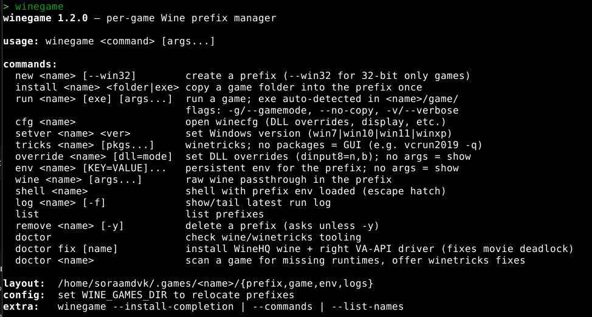

<div align="center">


# 🍷 winegame

**Per-game Wine prefix manager. One prefix per game, zero bloat.**

Plain `wine` + `winetricks`, organized. No Steam, no Lutris, no GUI daemons — a single bash script that keeps every game in its own isolated prefix with persistent env vars, DLL overrides, per-run logs, and a shell escape hatch.

[](LICENSE)


</div>

## Why

Cracked game folders, itch.io games, old Windows apps — they all want their own Wine environment, and sharing one prefix is how everything breaks. `winegame` gives each game its own `~/.games/<name>/` and makes the common operations one command each.



## Install

```bash
# winegame needs wine + winetricks (both standard packages)
# Debian/Ubuntu:  sudo apt install wine winetricks

# optional but recommended: gamemode for the -g flag
# Debian/Ubuntu:  sudo apt install gamemode

cp winegame ~/.local/bin/          # or anywhere on your PATH
winegame doctor [name]              verify tooling; with a name: scan a game for missing runtimes
winegame doctor fix                 one-shot: install WineHQ wine + fix video decode (see below)
```

## Quickstart

```bash
winegame new nekopara                     # create a prefix for a game
winegame run nekopara /path/to/Game.exe   # first run: prompted to copy the folder in
winegame tricks nekopara vcrun2019 -q     # install a runtime into that prefix
winegame override nekopara dinput8=n,b    # force a cracked DLL to load
winegame run -g nekopara                  # from now on: just this
```

## Why not just use Bottles?

[Bottles](https://usebottles.com/) is the same idea with a GUI — isolated per-game prefixes, runner switching, dependency installers. If you want a clickable interface and per-game Proton/DXVK runners, use Bottles. It's good at what it does.

`winegame` is for the other half of the room:

- **one bash script** — no Flatpak, no GTK app, no daemon. Works over SSH, in tmux, on a headless box
- **scriptable** — every operation is a command, so it drops into your own tooling
- **zero ceremony** — `winegame new` + `run` and you're in-game; no environment picker, no runner setup
- **transparent** — prefixes are plain folders under `~/.games/`, plain `wine` + `winetricks` underneath. Nothing hidden
- **`doctor fix`** — auto-installs WineHQ staging + the right VA-API driver, fixing the VN movie deadlock class of bug out of the box

GUI people get Bottles. Terminal people get `winegame`. Both fine.

## Troubleshooting

**Game hangs on a black/white window when playing a movie** (VN OP videos on Debian/Ubuntu):

Debian's wine build can deadlock on DirectShow video (`winegstreamer`). Fix once, every prefix benefits:

```bash
winegame doctor        # detects bad wine build + missing VA-API driver
winegame doctor fix    # installs WineHQ staging + right VA-API driver (iHD/radeonsi)
```

Then re-create any game that already hung (`winegame new` + `install`). After switching wine versions, run each game once — the prefix auto-upgrades silently on first launch.

## Usage

```
winegame new <name> [--win32]        create a prefix (--win32 for 32-bit only games)
winegame install <name> <folder|exe> copy a game folder into the prefix once
winegame run <name> [exe] [args...]  run a game; exe auto-detected in <name>/game/
                                     flags: -g/--gamemode, --no-copy, -v/--verbose
winegame cfg <name>                  open winecfg (DLL overrides, display, etc.)
winegame setver <name> <ver>         set Windows version (win7|win10|win11|winxp)
winegame tricks <name> [pkgs...]     winetricks; no packages = GUI (e.g. vcrun2019 -q)
winegame override <name> [dll=mode]  set DLL overrides (dinput8=n,b); no args = show
winegame env <name> [KEY=***]         persistent env for the prefix; no args = show
winegame wine <name> [args...]       raw wine passthrough in the prefix
winegame shell <name>                shell with prefix env loaded (escape hatch)
winegame log <name> [-f]             show/tail latest run log
winegame list                        list prefixes
winegame remove <name> [-y]          delete a prefix (asks unless -y)
winegame doctor                      check wine/winetricks tooling + wine build + GPU video driver
winegame doctor fix [name]           install WineHQ wine + right VA-API driver (fixes movie deadlock)
winegame doctor <name>               scan a game for missing runtimes, offer winetricks fixes
```

## Layout

```
~/.games/<name>/
├── prefix/    # the WINEPREFIX itself
├── game/      # your game files (installed here once)
├── env        # persistent env vars, exported to the game process on every run
└── logs/      # one timestamped log per run
```

The `env` file is sourced and **exported** into the wine process before every
launch — `LIBVA_DRIVER_NAME`, `WINEDLLOVERRIDES`, anything you put there
actually reaches the game. `winegame new` pre-fills it with the right VA-API
driver for your GPU.

Set `WINE_GAMES_DIR` to relocate everything (e.g. another drive).

## Shell completion

```bash
winegame --install-completion   # adds tab completion for bash or zsh
```

## Requirements

- bash 4+ (every Linux distro ships 5)
- wine (any modern version; WineHQ staging recommended)
- winetricks
- binutils (for objdump — used by `doctor <name>` import scanning)
- pciutils (for lspci — used by `doctor`/`doctor fix` GPU detection)
- rsync (optional — installs fall back to `cp`)
- gamemode (optional — powers the `-g` flag)

## License

MIT — do whatever, just don't blame me if a prefix eats your save files.
